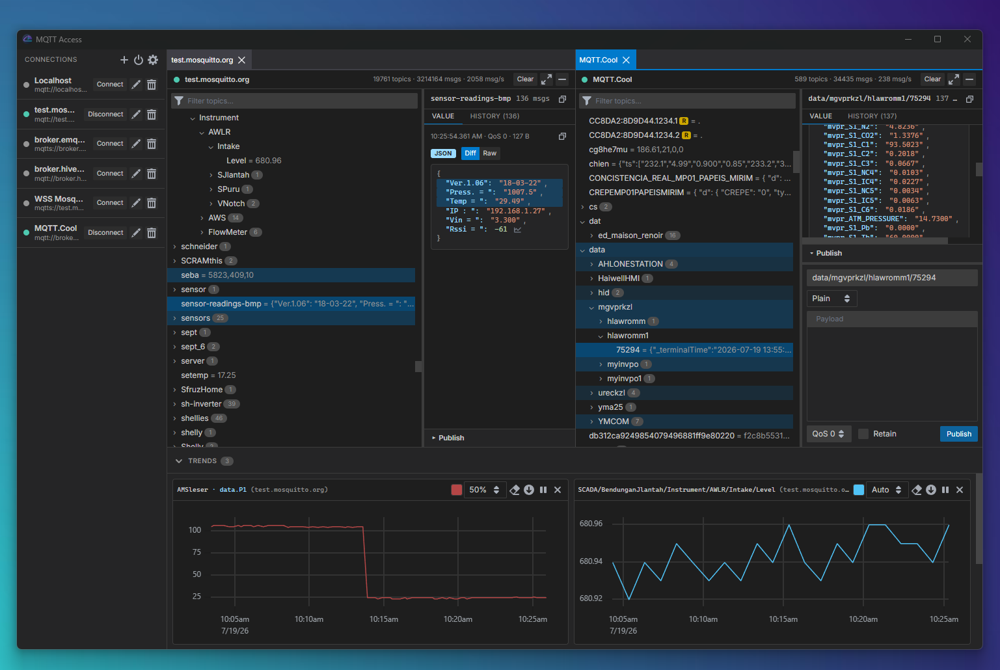

# MQTT Access

A cross-platform desktop MQTT explorer that connects to **multiple brokers
simultaneously**, each in its own dockable panel. Inspired by MQTT Explorer.

Built with **Wails v2** (Go backend) + **React + TypeScript** (Vite frontend),
styled with Blueprint 6.



## Features

- Multiple concurrent broker connections, each in a resizable / draggable /
	minimizable dock panel (dockview).
- Live hierarchical topic tree (virtualized) with per-topic latest-value
	preview, message counts, retained flags, and a blink-on-activity animation
	(can be turned off in Settings).
- Per-topic details:
	- **Value** tab — data-type badge (JSON/Number/Boolean/String/Binary),
		syntax-highlighted payload, and a Diff/Raw mode toggle. Diff mode
		highlights exactly which JSON fields changed since the previous message.
	- **History** tab — full message history with consecutive-payload diffs,
		syntax highlighting, and a per-entry copy button.
	- **Trends** — pin any numeric value (a bare numeric payload, or any
		numeric field inside a JSON payload) to a live chart from the Value tab.
		Trends live in a collapsible, resizable panel at the bottom of the app,
		update live regardless of what's selected in any topic tree, and persist
		across restarts. Each trend chart supports pause/resume, a custom series
		color, a clear-data button, CSV export, and adjustable width
		(33% / 50% / 100% / auto) with drag-to-reorder.
- Publish panel (open by default, resizable): choose a payload encoding —
	Plain, JSON, Base64, Hex, or XML — with format validation, a
	syntax-highlighted editor for JSON/XML, and a one-click prettify button.
	QoS 0/1/2 and retain supported.
- Test Connection button in the connection form — dials the broker without
	saving or affecting any existing connection; reports success/failure as a
	toast. Saving is never blocked by a failed test.
- Failed/dropped connections report a toast with the underlying error instead
	of hanging in "connecting" or showing an alarming permanent red status.
- Transports: `mqtt`, `mqtts`, `ws`, `wss` — with username/password auth and
	TLS options (CA cert, client cert/key, allow self-signed).
- 5 themes (Dark, Light, Dracula, Dark high contrast, White high contrast),
	3 font sizes, and 8 languages (English, Türkçe, Bahasa Indonesia, 日本語,
	中文, Español, Deutsch, Français), all in Settings along with an About
	section (version, developer, license, links).
- Connections, window layout, trends, and app settings persist locally;
	optional connect-on-startup.
- Message data is kept in RAM only while relevant, with a bounded per-topic
	history (default 1000 messages/topic); the topic tree and history survive a
	disconnect/reconnect cycle (only the "Clear" button wipes them).

## Architecture

Go owns the MQTT connections and all message data. Each connection configures a
Paho MQTT client and ingests incoming messages into a per-connection `TopicStore`
(topic trie + bounded per-topic history). A 100 ms **batcher** coalesces dirty
topics and emits one `mqtt:batch` Wails event (<=10 Hz) — cost is O(distinct
topics touched), not O(messages), so high-volume brokers don't flood the bridge.
The frontend keeps a lightweight off-React mirror tree for rendering and fetches
full payloads/history on demand.

Live per-message events (`mqtt:message`) are opt-in per topic via two
independent watch sets per connection: the tree-selection watch (one topic at a
time) and a separate trend watch set (any number of topics pinned to a trend
chart). Both are re-issued by the frontend after every successful (re)connect,
since a fresh connection handle starts with empty watch state.

Key files:
- `mqtt/client.go` — connection setup, transports, reconnect behavior, TLS
	wiring, the dual watch-set message filter
- `mqtt/store.go` — topic trie + bounded history
- `mqtt/batcher.go` — coalesced batch emission (`mqtt:batch`)
- `mqtt/handle.go` — per-connection watch state (tree-selection + trend sets)
- `app.go` — Wails-bound commands and event flow; app info, settings, and
	trend persistence
- `frontend/src/lib/topicMirror.ts` — off-React tree mirror + flatten
	(render-perf linchpin)
- `frontend/src/lib/json.ts` — payload type detection, JSON path
	resolution, and the structured/diff-aware JSON line renderer
- `frontend/src/components/dock/DockArea.tsx` — dockview panels, minimize
	strip, layout persistence
- `frontend/src/components/trends/` — trend charts, persistence, and the
	collapsible bottom panel
- `frontend/src/i18n/` — the 8 translation dictionaries and `useT()` hook

Local config lives in the OS app-config directory (`connections.json`,
`layout.json`, `settings.json`, `trends.json`) via `storage/storage.go`.

## Develop

```sh
cd frontend && npm install
cd ..
wails dev            # launch the app (dev)
wails build          # production bundle
cd frontend && npm test   # frontend unit tests (vitest)
go test ./...        # Go tests
```

## Testing with a broker

Public brokers (`broker.emqx.io`, `test.mosquitto.org`) work, but note that
their **bare `#` wildcard is often throttled/blocked** — subscribe to a specific
prefix like `bench/#` when testing.

For deterministic testing, run a local broker:

```sh
docker run -d --name mosq -p 18883:1883 -p 19001:9001 eclipse-mosquitto:2
```

Then add a connection to `localhost:18883` subscribed to `bench/#`, and publish
sample traffic (for example with `mosquitto_pub`) to validate tree updates,
history, and charts.
